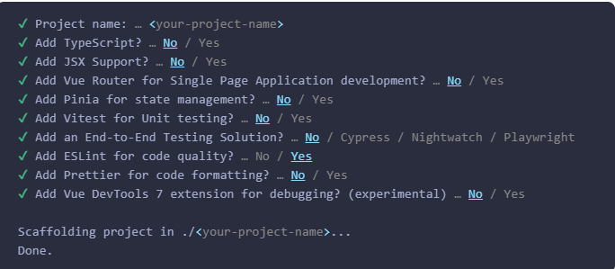

# 由cline + DeepSeek 生成，旨在快速了解各框架特性
> cline 生成vue2、vue2-ref-ts、vue3、react项目
## 快速了解各框架的特性和优缺点

#### 在 Vue 3 中，响应式数据是通过 Proxy 实现的，而 Vue 2 则是通过 Object.defineProperty 实现的。
#### 在 JavaScript 中有两种劫持 property 访问的方式：getter / setters 和 Proxies。Vue 2 使用 getter / setters 完全是出于支持旧版本浏览器的限制。而在 Vue 3 中则使用了 Proxy 来创建响应式对象，仅将 getter / setter 用于 ref
### 特别说明：Vue 2 已于 2023 年 12 月 31 日停止维护

1. vue2: webpack + vue2 + jest
版本说明：nodejs11+、webpack4.46.0、vue2.6.14、jest24.9.0

2. vue2-ref-ts: webpack + vue2 + ts + jest
版本说明：nodejs11+、webpack4.46.0、vue2.6.14、jest24.9.0、typescript4.1.3

#### Vue 3 最低支持nodejs 14.x+，如果需要配合Vite 3.x+最低支持nodejs 14.18.0+

#### Vue 3 本身是基于 ES6+ 语法构建的，并且使用了诸如 Proxy 等现代 JavaScript 功能，因此它与 Webpack 的某些配置和插件的兼容性有一定的要求。

#### Vue 2.7 通过一个新的插件提供对 Vite 的支持：@vitejs/plugin-vue2。这个新的插件需要 Vue 2.7 或更高版本，并取代了已有的 vite-plugin-vue2。
> 将 vue 升级至 ^2.7.0。同时你可以从依赖中移除 vue-template-compiler——它在 2.7 中已经不再需要了。

> 注意：如果你在使用 @vue/test-utils，那么 vue-template-compiler 需要保留，因为该测试工具集依赖了一些只有这个包会暴露的 API。

> 注意这个新插件刻意不会处理 Vue 特有的 JSX / TSX 转换。在 Vite 中，Vue 2 的 JSX / TSX 转换是通过一个独立的插件进行处理的：@vitejs/plugin-vue2-jsx。

> 参考： https://v2.cn.vuejs.org/v2/guide/migration-vue-2-7.html
#### Vue 3 官方推荐使用 Vite 构建工具，它内置了 Vue 3 的编译器，因此不需要再额外安装 vue-template-compiler，已经使用@vue/compiler-sfc替代；如果需要使用webpack，则需要手动安装 vue-template-compiler，一般使用webpack 5.x+

## vite 最大的优点（**编译速度嘎嘎快，仅仅hot更新的文件**）
### vite2.*-版本与vitest兼容性不好（所有没有适配），具体支持情况如下：
```
vitest v0 Vite >=v3.0.0 and Node >=v14.18

Vitest v1.6 1.0 requires Vite >=v5.0.0 and Node >=v18.0.0

Vitest v2 Vite >=v5.0.0 and Node >=v18.0.0

Vitest v3 Vite >=v5.0.0 和 Node >=v18.0.0
```

3. vue3: vite + vue3 + vitest
版本说明：nodejs14.18.0+、vite3.2.5、@vitejs/plugin-vue4.0.0、vue3.2.47、vitest0.32.2、typescript5.0.2

4. react: vite + react + vitest
版本说明：nodejs14.18.0+、vite4.4.5、@vitejs/plugin-react4.0.3、react18.3.1、vitest0.32.2

5. vue3-latest 由官方推荐脚手架方式创建，已安装 18.3 或更高版本的 Node.js
npm create vue@latest 请自行测试，一般会默认使用适配的最新版本vite，可手动选择TypeScript、JSX、Pinia、Vitest、Router、ESLint、Prettier、Vue DevTools支持
